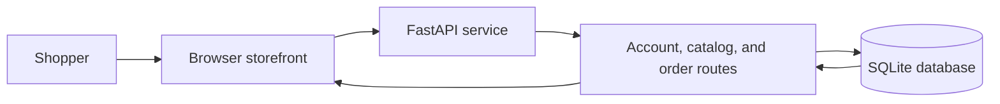

# CodeAlpha E-Commerce

<strong>A compact e-commerce prototype with a FastAPI service, product and order records, and a browser storefront.</strong>

Python · FastAPI · SQLite · HTML/CSS/JavaScript

## Project overview

The backend in `backend/app/main.py` serves the storefront and defines the API for user accounts, products, and orders. It creates SQLite tables for users, products, and orders. The `frontend/` folder currently contains the storefront entry page and its referenced static assets.

## Architecture

## Run and deployment status

The backend requirements are listed in `backend/requirements.txt`; the included Dockerfile targets port `7860`. Review the Docker build context and the hard-coded `/data` database location before using that Dockerfile as a deployment recipe: from the current repository layout, its `COPY` paths and data directory need a matching build context and persistent volume.

This repository is a prototype, not a production checkout service. The current code should receive a security and payment review before handling real credentials, orders, or customer data. Do not treat the presence of an orders table as payment processing.

## Project media

- [Recorded demo](httpsca-ecommerce-phi.vercel.app.mp4)
- [Interface capture](httpsca-project-mgmt.vercel.applogin.png)

## Project structure

- `backend/app/main.py` — FastAPI app and SQLite setup
- `backend/requirements.txt` — Python packages
- `backend/Dockerfile` — container recipe (see build-context note above)
- `frontend/index.html` — storefront entry page
